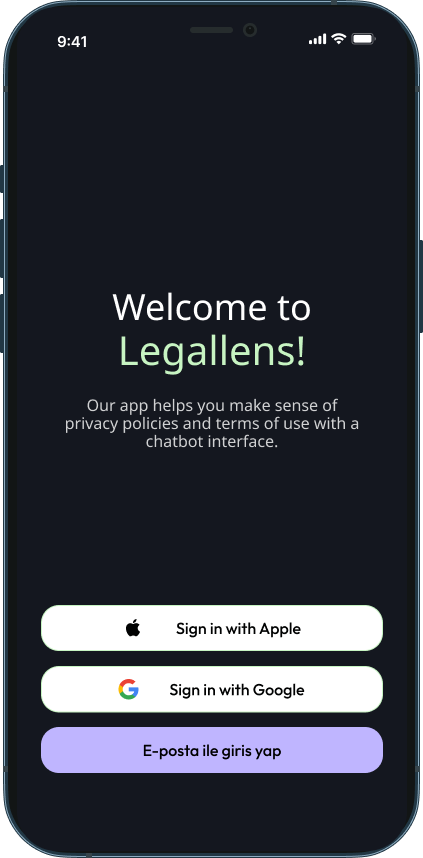
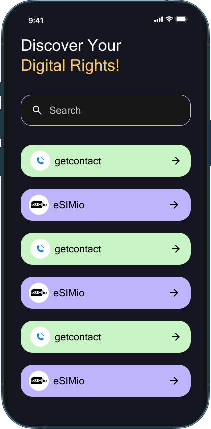
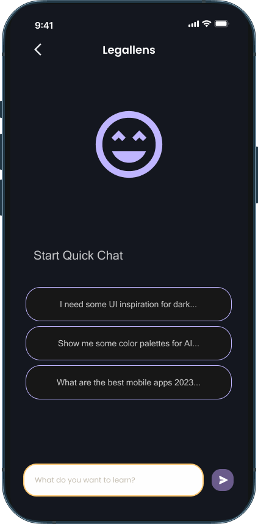
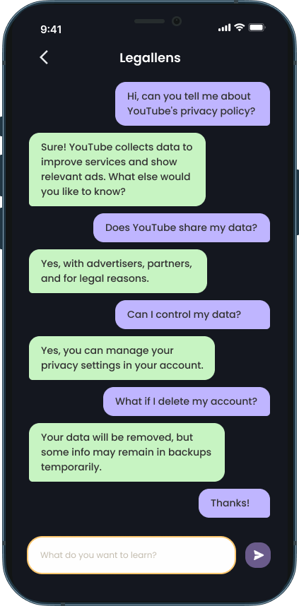

Sure, let's make your README more detailed and professional. Here's an improved version:

---

# LegalLens


Privacy policies are often long, complex, and difficult to understand. LegalLens is a mobile application that uses artificial intelligence to analyze privacy policies and provide users with concise summaries of the key points. It also compares the privacy policies of different applications, enabling users to make informed decisions about the apps they use.

## Table of Contents

- [Features](#features)
  - [Google and Apple Sign-In](#google-and-apple-sign-in)
  - [Worldwide Application Data](#worldwide-application-data)
  - [Discover Your Digital Rights with AI](#discover-your-digital-rights-with-ai)
- [Installation](#installation)
- [License](#license)
- [Contact](#contact)

## Features

### Google and Apple Sign-In

Seamlessly sign in to LegalLens using your Google or Apple account for a quick and secure authentication experience.



### Worldwide Application Data

Access a comprehensive database of applications from around the world. LegalLens provides an overview of various apps, making it easier to understand their privacy policies and compare them.



### Discover Your Digital Rights with Artificial Intelligence

Leverage the power of AI to analyze privacy policies. LegalLens offers insightful summaries and highlights key points, helping you understand your digital rights better.




## Installation

To install LegalLens, follow these steps:

1. Clone the repository:
    ```sh
    git clone https://github.com/yourusername/LegalLens.git
    ```
2. Navigate to the project directory:
    ```sh
    cd LegalLens
    ```
3. Install the necessary dependencies:
    ```sh
    flutter pub get
    ```

## Usage

To run the app on your local device or emulator, use the following command:

```sh
flutter run
```

For more detailed usage instructions and configuration options, please refer to the [Usage Guide](docs/UsageGuide.md).


## License

LegalLens is licensed under the [MIT License](LICENSE).

