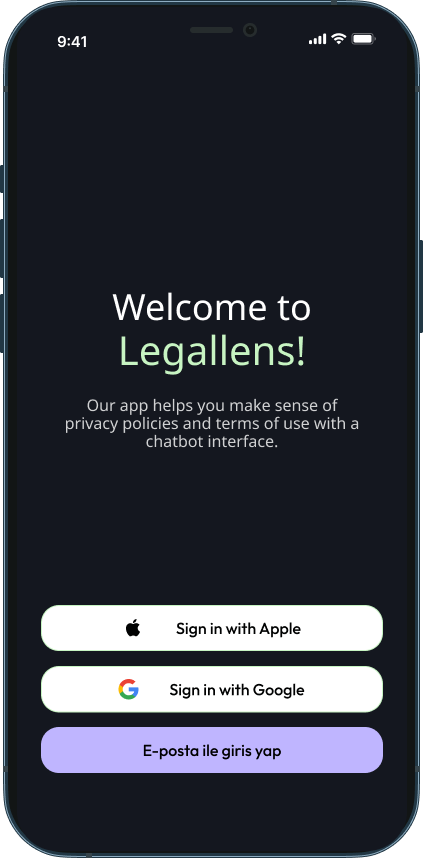
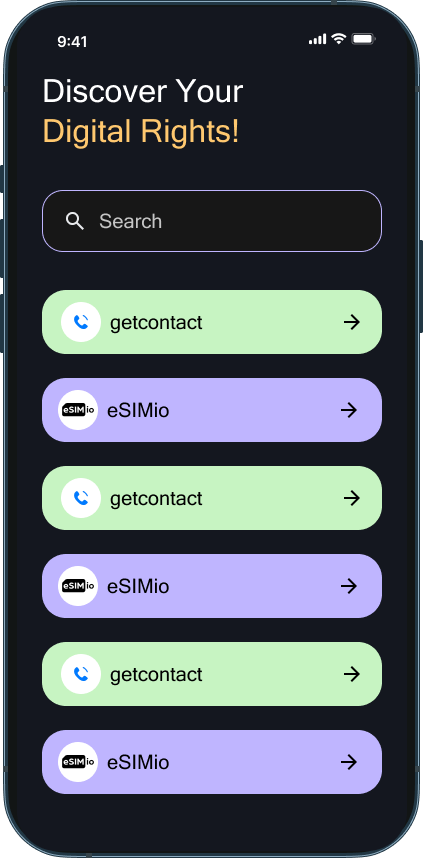
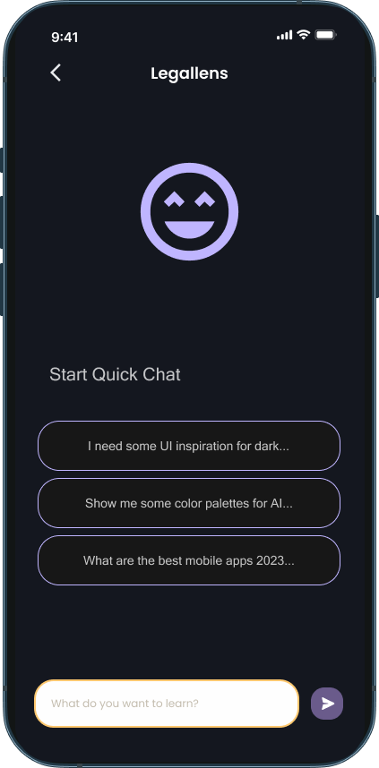
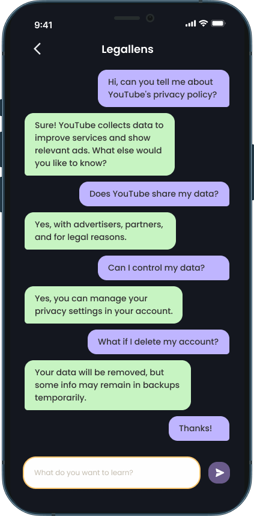

<div align="center">


# LegalLens

**Your AI-Powered Privacy Guardian**

[](https://flutter.dev/)
[](https://dart.dev/)
[](https://opensource.org/licenses/MIT)
[](https://pub.dev/packages/flutter_lints)

</div>

---

## 📖 About

**LegalLens** is a cutting-edge mobile application designed to simplify the complex world of privacy policies. In an era where digital rights are often buried in lengthy legal texts, LegalLens empowers users by forcing transparency.

Using advanced **Artificial Intelligence**, the app analyzes privacy policies to extract and summarize key points, ensuring you understand exactly what data you are sharing. Whether you are downloading a new game or a productivity tool, LegalLens helps you make informed decisions by allowing you to compare policies across different applications worldwide.

---

## ✨ Key Features

| **Seamless Authentication** | **Global App Database** |
|:---:|:---:|
|  |  |
| Quick and secure access using **Google** and **Apple** Sign-In integration. | Explore a vast database of applications from around the globe to check their privacy standards. |

<br>

| **AI-Powered Analysis** | **Detailed Insights** |
|:---:|:---:|
|  |  |
| **Instantly summarize** lengthy privacy policies into digestible highlights. | **Visualize your digital rights** with clear scores and comparative data. |

---

## 🛠 Tech Stack

This project relies on a robust and modern technology stack to ensure performance, scalability, and maintainability.

*   **Framework:** [Flutter](https://flutter.dev/)
*   **State Management:** [Riverpod](https://riverpod.dev/) (Hooks Riverpod & Riverpod Generator)
*   **Authentication:** [Firebase Auth](https://firebase.google.com/docs/auth) (Google & Apple)
*   **Networking:** [Dio](https://pub.dev/packages/dio) & [Retrofit](https://pub.dev/packages/retrofit)
*   **Data Serialization:** [Freezed](https://pub.dev/packages/freezed) & [Json Serializable](https://pub.dev/packages/json_serializable)
*   **Local Storage:** [Hive](https://docs.hivedb.dev/)
*   **Navigation:** [Go Router](https://pub.dev/packages/go_router)
*   **Localization:** [Easy Localization](https://pub.dev/packages/easy_localization)
*   **Functional Programming:** [fpdart](https://pub.dev/packages/fpdart)
*   **UI/UX:**
    *   `flex_color_scheme` for theming
    *   `animated_notch_bottom_bar` for navigation
    *   `google_fonts` for typography
    *   `flutter_swipe_action_cell` for interactions

---

## 📂 Project Structure

Key directories to help you navigate the codebase:

```
lib/
├── common/         # Shared widgets and utilities
├── config/         # App configuration (theme, routes)
├── constants/      # App-wide constants
├── data/           # Data layer (repositories, sources, models)
├── di/             # Dependency injection setup
├── features/       # Feature-based logic (screens, providers)
├── localization/   # Translation files logic
├── utils/          # Helper functions
└── main.dart       # Entry point
```

---

## 🚀 Getting Started

Follow these steps to set up the project locally.

### Prerequisites

*   **Flutter SDK**: `>=3.0.5 <4.0.0`
*   **Dart SDK**: Compatible with Flutter version
*   **Git**

### Installation

1.  **Clone the repository**
    ```bash
    git clone https://github.com/yourusername/LegalLens.git
    cd LegalLens
    ```

2.  **Install dependencies**
    ```bash
    flutter pub get
    ```

3.  **Code Generation**
    Since this project uses `freezed`, `riverpod`, and `retrofit`, you need to run the build runner:
    ```bash
    dart run build_runner build --delete-conflicting-outputs
    ```

4.  **Run the App**
    ```bash
    flutter run
    ```

---

## 📄 License

This project is licensed under the [MIT License](LICENSE).

---

<div align="center">
  <sub>Built with ❤️ by the LegalLens Team</sub>
</div>
